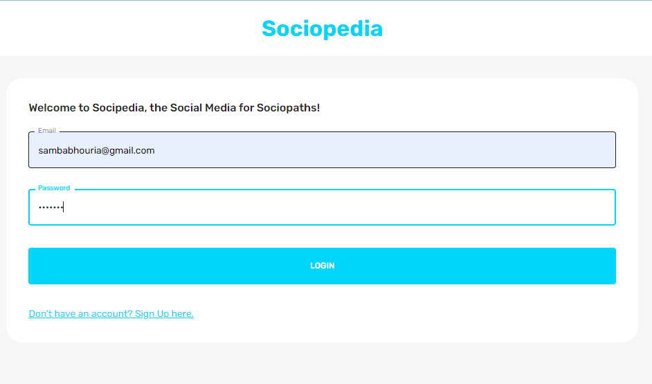
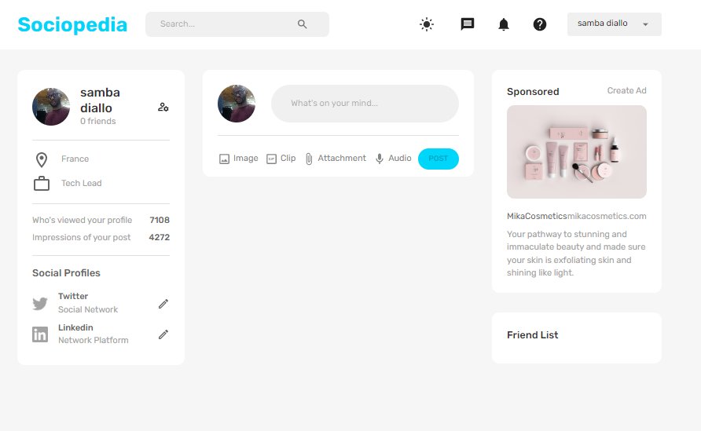

# FullStack Social Media App

Complete React Mongo Express React Node Full Stack Social Media App

# Topics

    1. Build a Fullstack MERN React Responsive Social Media Application from Scratch
    2. Backend Installation of Node, Visual Studio Code, and Backend Packages
    3. Backend Configurations and Middleware Setup
    4. MongoDB Registering, Installation and Setup
    5. Data Modeling and ERD Diagrams
    6. Authentication and Authorization in Node
    7. User Routes Setup
    8. Post Routes Setup
    9. React Redux File Folder Architecture and React Router
    10. Redux and Toolkit Installation and Setup
    11. Color, Theme, Dark Mode, and Styling Setup
    12. Navbar
    13. Register, Login Pages, and Form
    14. Home Page and Widgets
    15. Posts and Post Widge
    15. Profile Page
    15. Finaly full Full Stack MERN

# `screenShot`

